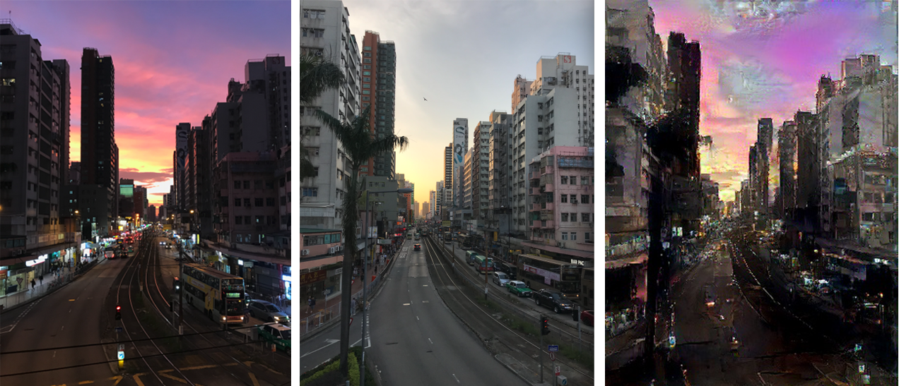
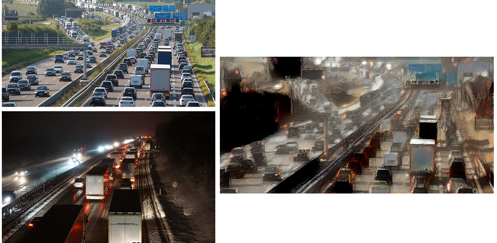
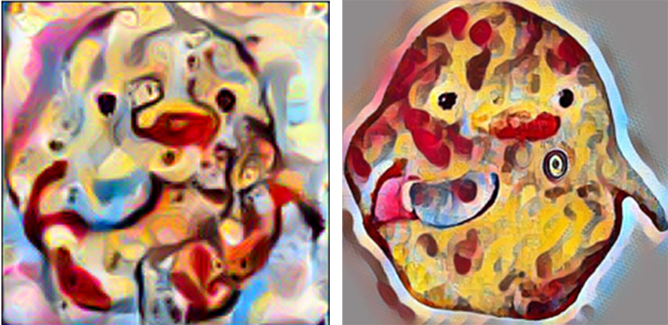

# Deep Learning 2020

This repository contains our bonus project files for the course Deep Learning 2020 at Technische Universität Darmstadt.

## Implementation 
The first task was to recreate the model in PyTorch according to the [A Neural Algorithm of Artistic Style](https://arxiv.org/abs/1508.06576) paper. 
Implementation was solely achieved with help of the paper and no third party libraries. The resulting Jupyter Notebook can be found as **neural_algorithm_of_artistsic_style.ipynb**.

Next up, this custom made model was compared to the Neural Transfer example project provided by PyTorch directly. The example can be found [here](https://pytorch.org/tutorials/advanced/neural_style_tutorial.html). We created a separate Jupyter Notebook for this project, called **pytorch-style-transfer.ipynb**.

## Tweaking
After verifying, that the models works and applies the desired style transfers, we started playing around with their inner workings. One resulting project can be found in the **pytorch-neural-style-transfer_2_styles** directory, based on yet another style transfer implementation [1]. This model was tweaked in order to not only accept one but two styles simultaneously. This means, one has to provide one content image and two style images that will be applied at the same time. However, the results were very artistic-styled and less photorealistic than we anticipated.

## Further Work

### Day-Night Transfer
Now that we have several working neural style transfer models, we wondered where this technology could be applied to. One aspect that we found interesting would be the application in self driving cars by applying day-night transfers on dashcam recordings. We tested this by applying a daylight road/city style to a night road/city content image and vice versa. However, the results were very artistic looking and not really photorealistic despite the fact that the style image was a photograph. 

### Video Style Transfer

Another approach was to apply neural style transfer to videos. As videos are just a series of images, we applied the style transfer to every 6th frame of a 30fps video to achieve a resulting 5fps video. The videofile can be found at [videos/video_style_transfer.mp4](videos/video_style_transfer.mp4). 
The video and therefore content images originate from a dashcam video of a drive across Darmstadt ([source](https://youtu.be/kOUMRfoqkE0?t=411)). 
As style we used a style by [Giger](https://wallpaperset.com/giger-wallpaper).
The initial results seem appealing. However, as the style is transferred to each frame independently, there is a lot of difference from frame to frame.

### Fast Style Transfer

After implementing our own Neural Style Transfer model we realized that the transfer process is very time consuming. We found another paper that deals with this issue, [Perceptual Losses for Real-Time Style Transfer and Super-Resolution](https://arxiv.org/abs/1603.08155). The style transfer by this model is orders of magnitudes faster than the proposed model by Gatys. However, while the transfer of a style onto a content image may be fast, the model has to be re-trained for every style. The Gatys model accepted a content and a style image, whereas the Johnson model only accepts a content image for a style-network.
One great use case for the Johnson model is the application of styles on videos and real time streams: Most likely only one style will be transferred to a video and therefore the downside of having to re-train the model on new styles seems negligible.

The left image was generated with the model proposed by Gatys, the right image was generated with the Fast Transfer Model. One can see that both images show the same style, however, they still look different. The style image applied is called [candy](https://i1.wp.com/bytefreaks.net/wp-content/uploads/2019/04/candy.jpg?w=1024&ssl=1).

### Deep Dream

Another Neural Style Transfer related topic is Google's Deep Dream. The implementation can be found in **deep_dream_pytorch.ipynb**.

## Sources

[1] Gordić, Aleksa. 2020. https://github.com/gordicaleksa/pytorch-neural-style-transfer
